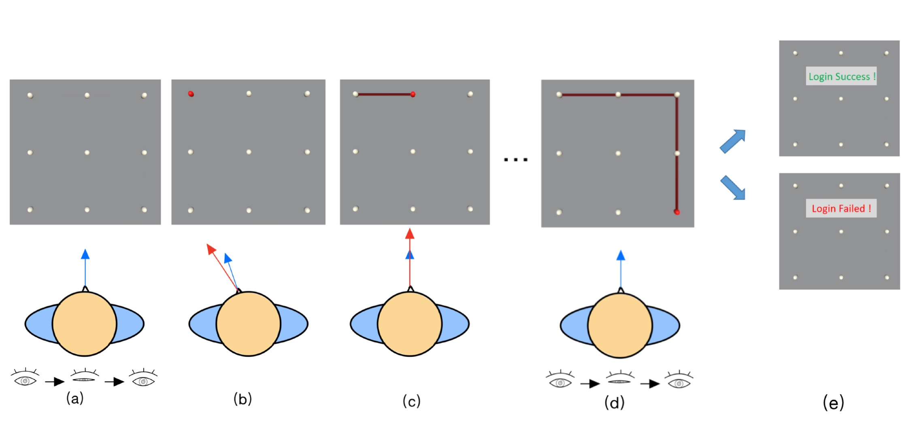

# CoordAuth

With the advance of virtual reality, there is an increasing appeal to protect users' privacy and security via authentication. However, existing knowledge-based authentication is lengthy and biometric authentication may potentially reveal users' data. Hence, we proposed CoordAuth, a two-factor authentication technology leveraging head-eye coordination features. To facilitate CoordAuth's design, we first conducted a study to analyze the effect of grid size (40$^\circ$ -- 100$^\circ$ FOV) on users' input performance. We found the medium-small size (60$^\circ$) was the most suitable setting and identified unique head-eye coordination features during input. Leveraging these features, CoordAuth combined pattern-based classifiers and majority voting-based behavioral biometric classifiers for two-factor authentication, achieving 0.04\% False Acceptance Rate (FAR) and 0.88\% False Rejection Rate (FRR) during leave-one-out simulation. CoordAuth also exhibited longitudinal stability with a 0.32\% FAR and 2.73\% FRR across 7 days. The subsequent usability and shoulder-surfing attack study proved CoordAuth's usability and robustness, where CoordAuth achieved 3.82s authentication time, 2.50\% Error Rate, and 0.60\% Attack Success Rate (ASR) comparable to knowledge-based and behavioral-biometric-based baselines.
